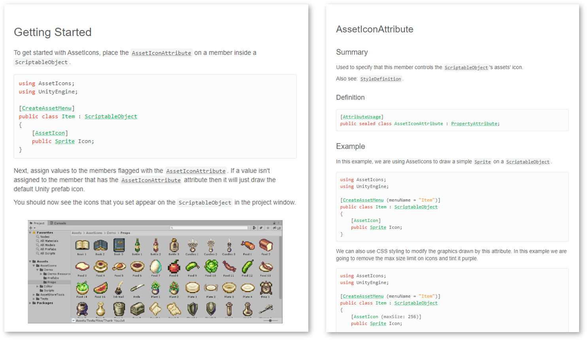

[](https://assetstore.unity.com/packages/tools/gui/asseticons-100547)

<p align=center><a title="https://github.com/Fydar/AssetIcons/issues?q=is%3Aissue+is%3Aopen+label%3Abug" href="https://github.com/Fydar/AssetIcons/issues?q=is%3Aissue+is%3Aopen+label%3Abug"></a>&nbsp;<a title="https://fydar.github.io/AssetIcons/Documentation#home" href="https://fydar.github.io/AssetIcons/Documentation#home"></a>&nbsp;<a title="https://assetstore.unity.com/packages/tools/gui/asseticons-100547" href="https://assetstore.unity.com/packages/tools/gui/asseticons-100547"></a></p>
<div>&nbsp;</div>
<p>

Organise your projects and manage your assets with a single attribute.

```csharp
using AssetIcons;
using UnityEngine;

[CreateAssetMenu]
public class ItemInformation : ScriptableObject
{
    [AssetIcon]
    public Sprite ItemIcon;
}
```

## Features

- Dynamic icons for ScriptableObjects
- Custom icons per file extension
- Customize icons with attribute-defined styles
- Easy-to-use
- [High-quality documentation](https://fydar.github.io/AssetIcons/Documentation#home)
- [Public issue tracker](https://github.com/Fydar/AssetIcons/issues)
- In-editor update checker
- Error detection and reporting
- Support for Unity's Collaborate overlay
- Support for Unity's Version Control overlay

[](https://assetstore.unity.com/packages/tools/gui/asseticons-100547)

## Issue Tracker

This repository serves as the issue tracker for AssetIcons. Feel free to submit suggestions, bugs or questions here.

[](https://github.com/Fydar/AssetIcons/issues?q=is%3Aissue+is%3Aopen+label%3Abug)

## Documentation

[](https://fydar.github.io/AssetIcons/Documentation#home)

## Find out more

- [Store page](https://assetstore.unity.com/packages/tools/gui/asseticons-100547)
- [Full documentation and usage guide](https://fydar.github.io/AssetIcons/Documentation#home)
