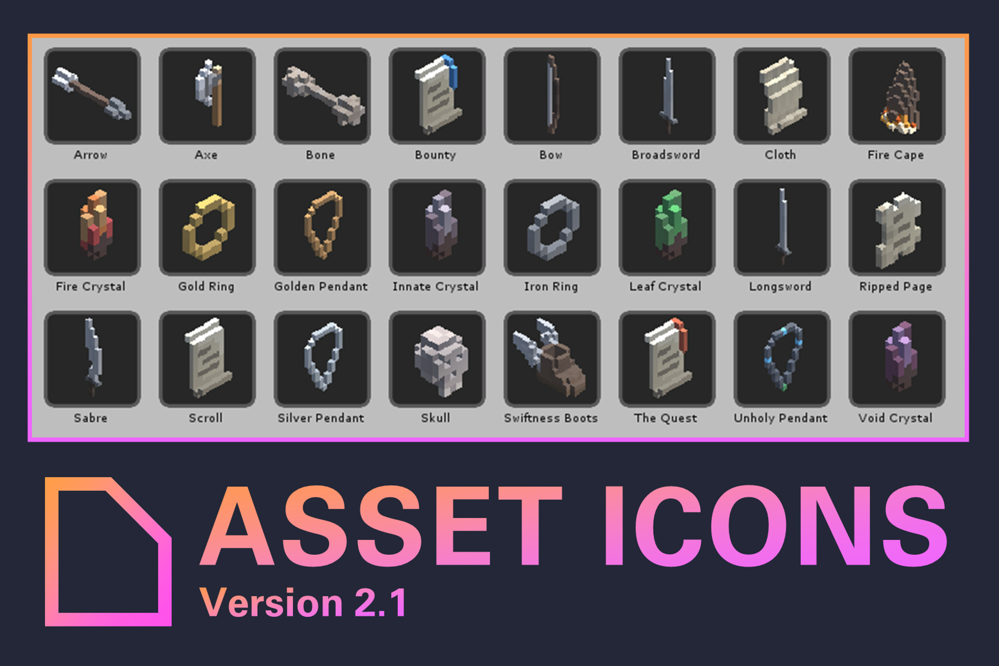
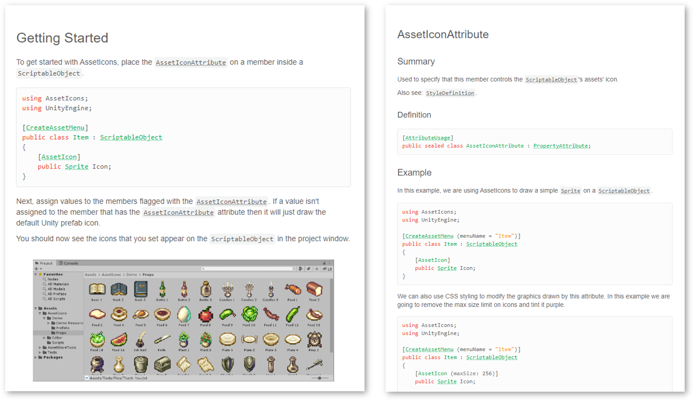

[](https://assetstore.unity.com/packages/tools/gui/asseticons-100547)

# AssetIcons

[](https://github.com/Fydar/AssetIcons/issues?q=is%3Aissue+is%3Aopen+label%3Abug) [](https://fydar.github.io/AssetIcons/Documentation#home) [](https://assetstore.unity.com/packages/tools/gui/asseticons-100547)

Organise your projects and manage your assets with a single attribute.

```csharp
[CreateAssetMenu]
public class ItemInformation : ScriptableObject
{
    [AssetIcon]
    public Sprite ItemIcon;
}
```

[](https://assetstore.unity.com/packages/tools/gui/asseticons-100547)

## Features

- Dynamic icons for ScriptableObjects
- Customize icons with attribute-defined styles
- Configurable
- Easy to use
- Custom icons per file extension
- Support for Unity's Collaborate overlay
- Support for Unity's Version Control overlay

## Issue Tracker

This repository serves as the issue tracker for AssetIcons. Feel free to submit suggestions, bugs or questions here.

[](https://github.com/Fydar/AssetIcons/issues?q=is%3Aissue+is%3Aopen+label%3Abug)

## Documentation

[](https://fydar.github.io/AssetIcons/Documentation#home)

## Find out more

For support or enquiries, please contact me at dev.anthonymarmont@gmail.com

- [Store page](https://assetstore.unity.com/packages/tools/gui/asseticons-100547)
- [Full documentation and usage guide](https://fydar.github.io/AssetIcons/Documentation#home)
